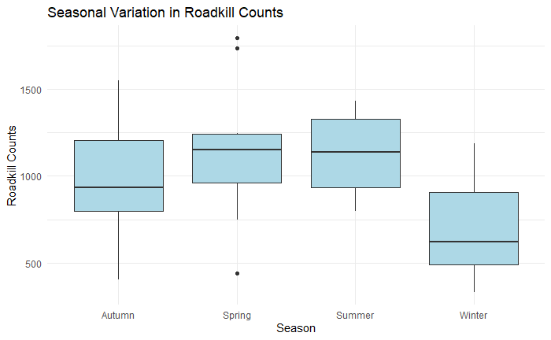

```{r setup, include=FALSE}
knitr::opts_chunk$set(echo = TRUE)
```

“I have familiarised myself with the academic misconduct and plagiarism guidelines in the Academic Honesty and Plagiarism module and the MTHM601 (Fundamentals of Data Science) ELE site’s Assessment Information tab. This report constitutes my own work, and I have explicitly referenced and acknowledged those parts that draw on the literature, online sources, and the support of others. This includes acknowledgment of any use of Artificial Intelligence tools such as ChatGPT”

## Introduction

**Topics:** Data Wrangling, Advanced Visualisation, RMarkdown, Hierarchical Modelling, Spatial Visualisation, Temporal Trends, GitHub

With the ever-changing climate, British wildlife face an uncertain future, with a major decline in biodiversity being found all around the United Kingdom. But another thing that could be adding to the decline in British wildlife is road-traffic-accidents; collisions with vehicles is one of the major causes of wild animal death in the UK [@raymond_temporal_2021]. For animals that are already under immense pressure due to anthropogenic and climate threats, roadkill could push some of these species to extinction.

This report aims to provide a comprehensive exploration of roadkill trends across the UK, leveraging data science techniques to address questions about its spatial, temporal and environmental dynamics, with a specific focus on mammals.

Focusing on mammals is particularly relevant due to their ecological importance and the disproportionate impact of roadkill on their populations. Many mammal species are wide ranging with large territories that are increasingly being split up by roads, making them more vulnerable to collisions. By narrowing the scope to mammals, this study aims to provide actionable insights for mitigating roadkill impacts on vulnerable mammalian species.

The three main questions I am hoping to answer are:

1.  What are the seasonal trends in mammalian roadkill numbers?

2.  Do temperature or rainfall play a role in mammalian roadkill prevalence?

3.  Where are the mammalian roadkill hotspots across the UK?

## Objectives/Methodology

After extensive data wrangling...

Talk about QQ plots

Q1

Spatial - using tmap package in r - create a map of regional roadkill reports

Data was split into count per region, after plotting a histogram and a Q-Q plot, it was obvious that the data was not normally distributed.

Overdispersion of a poisson glm was calculated using the dispersion statistic:

A value of `inf` inidicated overdisapersion, justifying the use of a negative binomial GLM over Poisson regression.

q2

QQ plots, leverage, etc of the linear model are not good. Trying GAM instead.

Q3

Key R Packages I used:

-   **Data wrangling:** tidyverse, dplyr

-   **Data visualisation:** tmap, flextable, ggplot2

-   **Data Analysis:** MASS, Lme4

## Data

### Roadkill Data

The data I will use is from The Road Lab (formerly 'Project Splatter') [<https://www.theroadlab.co.uk/>], it is a citizen science project with 57 columns and 68,212 rows of data. The dataset includes mammals, birds, amphibians and reptiles but, as this report is only interested in mammals, all rows corresponding with other Classes will be removed. I also removed any rows that had blank entries in any of my columns of interest.

Data was collected between 01/01/2014 until 30/09/2024 but as there was only one entry and it was not the complete year, data from 2024 was removed. There were several recordings of “indet. Deer”, "rabbits and hares" and a "Polecat-Ferret" which were also removed as they were not to a species level. Some records were grouped under one standardised species name, "Eastern Grey Squirrel" and "Squirrel" became "Grey Squirrel" because Red Squirrels (LATIN) are rare in most parts of the UK so these records were separated from those of "Red Squirrel", the same goes for "Brown Rat" and "Rat spp." because Black Rats (LATIN) are also very rare so any records were assumed to be Brown Rats (LATIN). I also grouped all mouse, bat, vole and hare records into their respective group rather than species level.

{alt="Graph showing total monthly roadkill reports from January 2014 to January 2024, showing (a) the spike in reports in July - September 2019. (b) after scaling and sub-sampling the inflated reports from July - September 2019. And (c) after taking a random sample of the reports from July - September 2019 that were equal to the means from those months in the other years."}

It is important to note that there is a large spike in reports in July and August 2019 (figure 1a), I have decided try to scale it in line with reports from other years, as it is not likely to reflect an actual massive increase in roadkill but it likely a result of increased news coverage on the project [<https://www.bbc.co.uk/news/science-environment-48886673>]. I followed the methods from Raymond et al's [@raymond_temporal_2021] paper for this but I feel that it still left a spike too large to be representative (figure 1b) of the actual roadkill numbers, ultimately leading to the removal of the reports from July and August 2019. I then calculated the mean number of roadkill reports for July, August and September separately, not including 2019 values. Once I had the means, I randomly selected that number from the 2019 reports for each month and removed the rest from those months (figure 1c). This was the only solution I could think of that kept the majority of the data without skewing the seasonal trends in roadkill. Once the data was cleaned and all unneeded data was removed, I was left with 39130 entries. I also created a separate dataset that combined the reports for each month to create a monthly count of roadkill reports for some of the plots and analyses.

### Weather Data

This data will then be combined with data on the mean monthly temperature and total rainfall per month from the Met Office. [<https://www.metoffice.gov.uk/research/climate/maps-and-data/uk-and-regional-series>]

According to the met office, the seasons will be split into months. The months of March, April and May are now "Spring", June, July and August are "Summer", September, October and November are "Autumn" and December, January and February are "Winter" months.

## Results

### Seasonal trends in roadkill

Four negative binomial Generalised Linear models were fitted to evaluate the effects of year, season and their interaction on roadkill counts. To determine the best-fitting model for roadkill counts, I conducted likelihood ratio tests (Chi-squared tests) between nested models. These tests assess whether adding predictors or including interaction terms significantly improves the model fit. This approach allows for a stepwise comparison of the models to identify the simplest model that adequately explains the variability in roadkill counts. The Year-only model had the highest AIC (591.84), indicating poor fit compared to models including Season. Adding Season significantly improved the model, as evidenced by a lower AIC (584.73) and a significant Likelihood Ratio Test (

$\chi^2$ = 11.11, p \< 0.01; Table 1). The Year + Season model had a slightly higher AIC (585.91) and did not significantly improve fit over the Season-only model ($\chi^2$ = 0.82, p = 0.36). Similarly, the interaction model was more complex but failed to improve fit (AIC = 590.42, $\chi^2$= 1.48, p = 0.69). These results suggest that Season is a significant predictor of roadkill counts, while Year and the Year × Season interaction do not provide additional explanatory power. The Season-only model provides the best balance of simplicity and fit.

| Model          | AIC    | LogLik  | DF  | LR stat | P Value    |
|----------------|--------|---------|-----|---------|------------|
| Year           | 591.84 | -292.92 | 3   | N/A     | N/A        |
| Season         | 584.73 | -287.36 | 5   | 11.11   | **\<0.01** |
| Year + Season  | 585.91 | -286.95 | 6   | 0.82    | 0.36       |
| Year \* Season | 590.42 | -286.21 | 9   | 1.48    | 0.69       |

: Summary of the models along with comparison stats and P values.

The chosen negative binomial model suggested that winter had significantly lower roadkill counts compared to the reference season, Autumn (p = 0.0237). No significant differences were observed for Spring (p = 0.2993) or Summer (p = 0.3419) relative to Autumn. This suggests that roadkill counts are relatively stable across spring, summer, and autumn, but decrease significantly in winter (figure 2).



### Impacts of weather on roadkill

Generalised Linear Mixed Model with a poisson family was used due to the response variable being count data, with mean temperature and rainfall as fixed effects and region as a random effect.

### Where are the roadkill hotspots?


View an interactive version of this map [here](https://universityofexeteruk-my.sharepoint.com/:u:/r/personal/mf683_exeter_ac_uk/Documents/MTHM601%20Report/Interactive-map.html?csf=1&web=1&e=BQBdNb)

The region with the highest roadkill count is Norfolk (n=3760) and the region with the lowest was Inner London - West (n=8).

To assess the significance of variation among regions, I wanted to use a GLM. To determine the correct family I first checked normality, I checked for over-dispersion using this dispersion statistic:

$$
\text{Dispersion} = \frac{\text{Residual Deviance}}{\text{Degrees of Freedom}} 
$$

Any values above 1 show over-dispersion, for a Poisson GLM using this data, the dispersion statistic was infinite, meaning it was completely over-dispersed. Meaning a negative binomial GLM was required instead.

## Limitations

### Limitations of the data

-   Larger species are more likely to be seen and reported

-   Only covers animals that die immediately and not those that get out of the road before dying

-   Citizen science always comes with limitations

-   Bias in sampling - massive increase after coverage in the news but only lasted for 2 months

-   However, previous studies in South Africa [@periquet_testing_2018] and California have shown the identification data to be reliable [@waetjen_large_2017]

### Limitations of the analysis

Correlation does not mean causation!

My data is not completely normal so some analyses may not be completely accurate

Potential to look into species trends but wasn't within the scope for this report

Looking at differences between regions is difficult when there is large variation in size, which is not something that I accounted for

## Conclusions

### Seasonal Trends

Roadkill reports are significantly lower in the Winter than any of the other seasons, with report numbers being relatively stable across Spring, Summer and Autumn. This could be due to a number of ecological and environmental factors. During winter, many mammal species reduce their activity due to colder temperatures and limited food availability, some species enter hibernation or even migrate to other regions, further reducing their presence in areas where roadkill incidents typically occur. Environmental factors such as icy road conditions might also contribute to reduced speeds, giving drivers more time to react to animals on the road. Collectively, these factors likely explain the seasonal dip in roadkill counts during the winter months. However, shorter daylight hours in winter may result in more people traveling during darkness, which could limit their ability to see and report roadkill incidents, leading to under-reporting.

### Impacts of weather on roadkill

### Where are the roadkill hotspots?

## Reproducibility

All code and data files used for the analysis in this report can be found in a GitHub repository here:

## References
