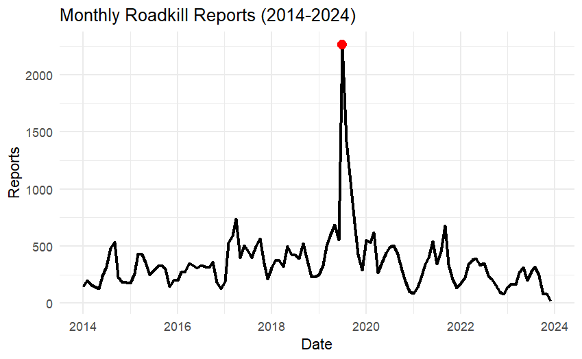

```{r setup, include=FALSE}
knitr::opts_chunk$set(echo = TRUE)
```

“I have familiarised myself with the academic misconduct and plagiarism guidelines in the Academic Honesty and Plagiarism module and the MTHM601 (Fundamentals of Data Science) ELE site’s Assessment Information tab. This report constitutes my own work, and I have explicitly referenced and acknowledged those parts that draw on the literature, online sources, and the support of others. This includes acknowledgment of any use of Artificial Intelligence tools such as ChatGPT”

## Introduction

**Topics:** Data Wrangling, Advanced Visualisation, RMarkdown, Hierarchical Modelling, Spatial Visualisation, Temporal Trends, GitHub

With the ever-changing climate, British wildlife face an uncertain future, with a major decline in biodiversity being found all around the United Kingdom. But another thing that could be adding to the decline in British wildlife is road-traffic-accidents; collisions with vehicles is one of the major causes of wild animal death in the UK [@raymond_temporal_2021]. For animals that are already under immense pressure due to anthropogenic and climate threats, roadkill could push some of these species to extinction.

This report aims to provide a comprehensive exploration of roadkill trends across the UK, leveraging data science techniques to address questions about its spatial, temporal and environmental dynamics, with a specific focus on mammals.

Focusing on mammals is particularly relevant due to their ecological importance and the disproportionate impact of roadkill on their populations. Many mammal species are wide ranging with large territories that are increasingly being split up by roads, making them more vulnerable to collisions. By narrowing the scope to mammals, this study aims to provide actionable insights for mitigating roadkill impacts on vulnerable mammalian species.

The four main questions I am hoping to answer are:

1.  What are the spatial and seasonal trends in mammalian roadkill numbers?

2.  Do temperature or rainfall play a role in mammalian roadkill prevalence?

3.  Where are the mammalian roadkill hotspots across the UK?

4.  Which mammalian species are most commonly recorded as roadkill?

## Objectives/Methodology

## Data

### Roadkill Data

The data I will use is from The Road Lab (formerly 'Project Splatter') [<https://www.theroadlab.co.uk/>], it is a citizen science project with 57 columns and 68,212 rows of data. The dataset includes mammals, birds, amphibians and reptiles but, as this report is only interested in mammals, all rows corresponding with other Classes will be removed. I also removed any rows that had blank entries in any of my columns of interest.

Data was collected between 01/01/2014 until 30/09/2024 but as there was only one entry and it was not the complete year, data from 2024 was removed. There were several recordings of “indet. Deer”, "rabbits and hares" and a "Polecat-Ferret" which were also removed as they were not to a species level. Some records were grouped under one standardised species name, "Eastern Grey Squirrel" and "Squirrel" became "Grey Squirrel" because Red Squirrels (LATIN) are rare in most parts of the UK so these records were separated from those of "Red Squirrel", the same goes for "Brown Rat" and "Rat spp." because Black Rats (LATIN) are also very rare so any records were assumed to be Brown Rats (LATIN). I also grouped all mouse, bat, vole and hare records into their respective group rather than species level.

Once the data was cleaned and all unneeded data was removed, I was left with 42810 entries.

It is important to note that there is a large spike in reports in July and August 2019, I have decided try to scale it in line with reports from other years, as it is not likely to reflect an actual massive increase in roadkill but it likely a result of increased news coverage on the project [<https://www.bbc.co.uk/news/science-environment-48886673>].

### Seasonal/Weather Data

This data will then be combined with data on the mean monthly temperature and total rainfall per month from the Met Office. [<https://www.metoffice.gov.uk/research/climate/maps-and-data/uk-and-regional-series>]

According to the met office, the seasons will be split into months. The months of March, April and May are now "Spring", June, July and August are "Summer", September, October and November are "Autumn" and December, January and February are "Winter" months.

## Results

### Exploratory Analysis

What I want to include:

-   Overall number of reports per month




Graph showing the

-   Reports per season

-   Multiple maps of the UK showing reports per season

-   Overall species' barchart

### Seasonal trends in roadkill

### Spatial Trends in roadkill

## Limitations

### Limitations of the data

-   Larger species are more likely to be seen and reported

-   Only covers animals that die immediately and not those that get out of the road before dying

-   Citizen science always comes with limitations

-   Bias in sampling - massive increase after coverage in the news but only lasted for 2 months

-   However, previous studies in South Africa [@periquet_testing_2018] and California have shown the identification data to be reliable [@waetjen_large_2017]

### Limitations of the analysis

Correlation does not mean causation!

My data is not completely normal so some analyses may not be completely accurate

## Conclusion

## Reproducibility

All code and data files used for the analysis in this report can be found in a GitHub repository here:

## References
